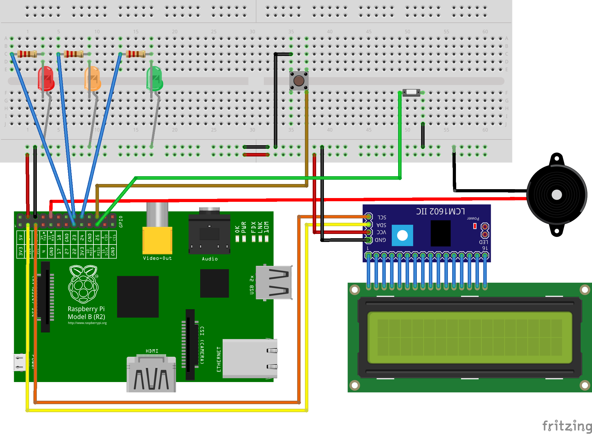

# Daployer
An IoT device (based on Raspberry Pi) to execute scripts pressing a big button!  
The idea is based on this [tweet](https://twitter.com/martinwoodward/status/1117165603549339648?s=19) and right now the [project is starting](https://www.instagram.com/p/B1G9lQkolH4/).

It is based on [AnalogZero](https://github.com/raspitv/analogzero) for the LCD library.

## Install

### Software Requirements

* https://dietpi.com/
* Execute `install.sh`

### Hardware requirements

This project is built as modular, you can choose what you need by enabling in the `config.ini` file and configuring the pin to use.

#### Mandatory

* I2C LCD screen 20x4
* Keyboard or numpad connected
* 1 Button

#### Options

* 3 LEDs
* 1 Button
* 1 Tonal buzzer